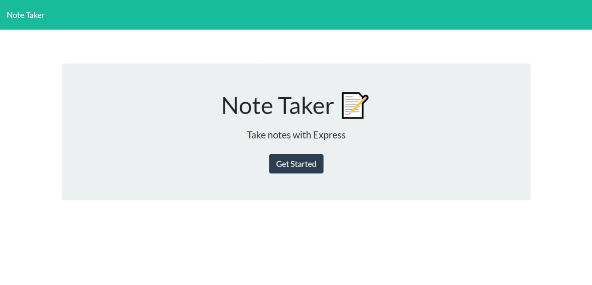
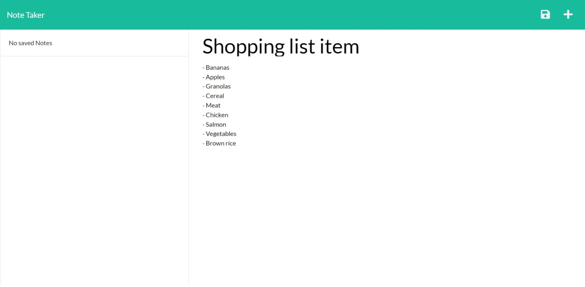
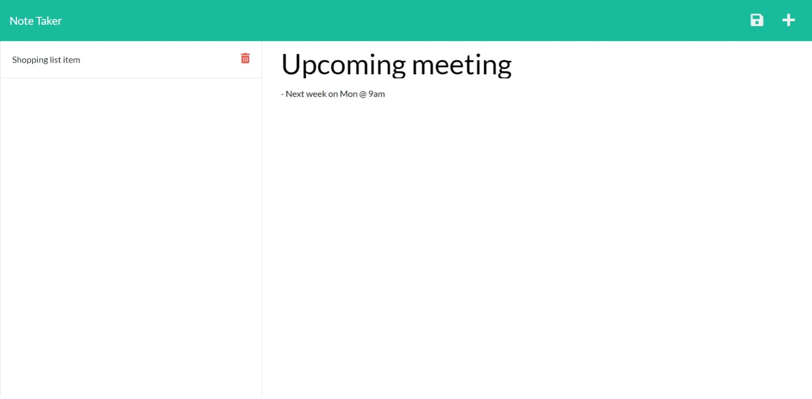
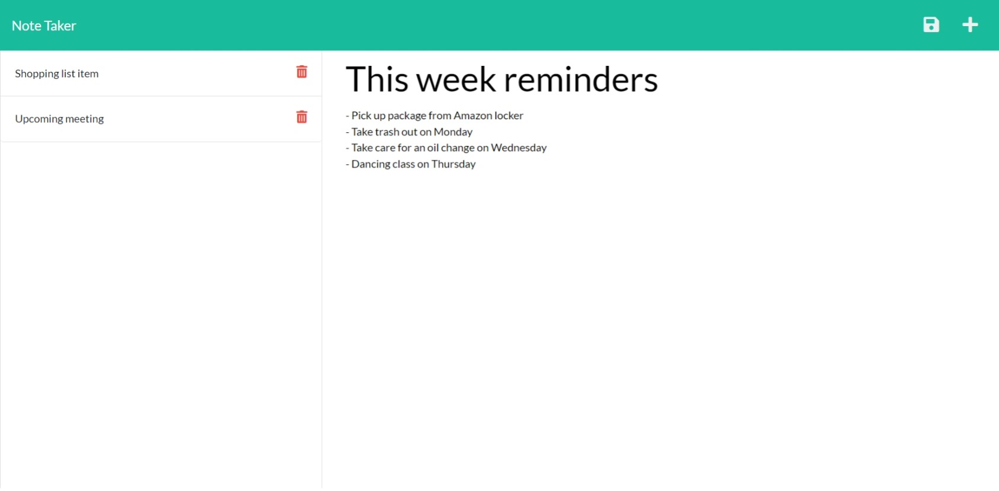
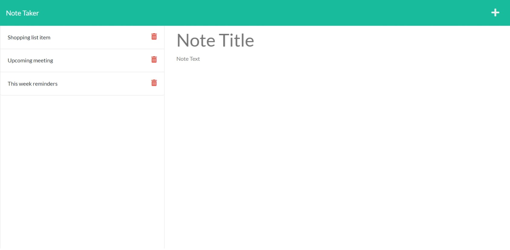

# Note Taker (Express.js)

## App description

- This a modified starter code creating an application called Note Taker that can be used to write, save, and delete notes. This application use an Express.js back end and save and retrieve note data from a JSON file.

- The application’s front end was already been created. My job was to build the back end, connect the two, and then deploy the entire application to Heroku.

## User Story

```
AS A small business owner
I WANT to be able to write, save, and delete notes
SO THAT I can organize my thoughts and keep track of tasks I need to complete
```

## Acceptance Criteria

```
GIVEN a note-taking application
WHEN I open the Note Taker
THEN I am presented with a landing page with a link to a notes page
WHEN I click on the link to the notes page
THEN I am presented with a page with existing notes listed in the left-hand column, plus empty fields to enter a new note title and the note’s text in the right-hand column
WHEN I enter a new note title and the note’s text
THEN a Save icon appears in the navigation at the top of the page
WHEN I click on the Save icon
THEN the new note I have entered is saved and appears in the left-hand column with the other existing notes
WHEN I click on an existing note in the list in the left-hand column
THEN that note appears in the right-hand column
WHEN I click the delete button (red trash can), the note saved gets deleted in the left-hand column
WHEN I click on the Write icon in the navigation at the top of the page
THEN I am presented with empty fields to enter a new note title and the note’s text in the right-hand column
```
## Technologies Used

- [Express.js](http://expressjs.com/)
- [File System](https://nodejs.org/api/fs.html#fs_file_system)
- [ID generator uuid4](https://www.uuidgenerator.net/version4)

## App Deployed Heruko Link

- Please follow [THIS LINK!](https://note-taker-z20axa.herokuapp.com/)

## App Screenshots 





